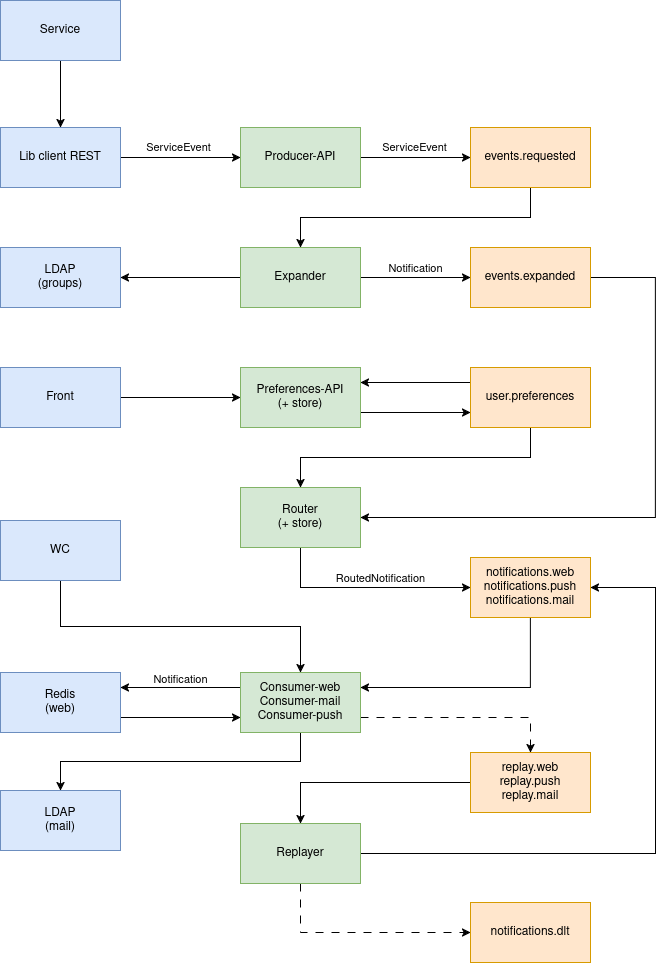

# POC Notifications

Ce projet englobe tous les modules nécessaires au lancement du POC de la plateforme de notifications. Il est self-contained, c'est-à-dire qu'il peut tourner pour des besoins de test et de développement sans aucune dépendance extérieure.

Le schéma de l’architecture mise en place est le suivant :

Technologies utilisées :
- Serveur kafka 4.2 (latest)
- Spring boot 4
- Java 21+

## [Service-example-kafka-poc](service-example-kafka-poc/README.md)

Service d'exemple qui envoie une notification en se servant de la librairie client mise à disposition.

## [Producer-api-poc](producer-api-poc/README.md)

API qui reçoit des requêtes de l'extérieur et joue le rôle de producer pour le Kafka. Vérifie que le service a bien le droit d'envoyer une notification en fonction de son API Key et de son adresse IP. Ne fait aucun travail sur les events et se contente de les retransmettre tels quel au Kafka.

## [Expand-kafka-poc](expand-kafka-poc/README.md)

Consumer et producer Kafka qui a pour rôle de construire toutes les notifications par utilisateur  (potentiellement une liste de groupes ou d'utilisateurs) pour un event donné. Communique avec le LDAP pour récupérer les utilisateurs composants un groupe.

## [Preferences-api-poc](preferences-api-poc/README.md)

API, producer et consumer Kafka qui a 2 rôles, récupérer et permettre l'affichage des préférences de l'utilisateur, ainsi que produire dans le Kafka de nouvelles préférences utilisateur.

## [Routing-kafka-poc](routing-kafka-poc/README.md)

Stream Kafka au centre de l'architecture qui gère le routage des notifications. Il dépose les notifications entrantes dans le bon topic de sortie en fonction des préférences utilisateurs.

## Consumers

La plateforme possède 3 consommateurs qui écoutent sur des topics différents en fonction du moyen d'émission :

### [Consumer-kafka-poc](consumer-kafka-poc/README.md)

Ce consumer écoute les notifications web. Dès qu'il reçoit une notification, il la dépose dans un redis. Il joue également le rôle d'API pour servir toutes les notifications d'un utilisateur en particulier (qu'on peut retrouver dans le redis).

### [Consumer-mail-poc](consumer-mail-poc/README.md)

Ce consumer écoute les notifications à envoyer par mail. Il récupère l'adresse mail de l'utilisateur via une requête LDAP en fonction de son uid puis envoie le mail.

### [Consumer-push-poc](consumer-push-poc/README.md)

Ce consumer écoute les notifications à envoyer par méthode push (mobile). Pour l'instant il ne fait encore aucune action.

## [Replayer-kafka-poc](replayer-kafka-poc/README.md)

Consumer et producer qui se charge de rejouer les notifications qui sont à rejouer à cause du droit à la déconnexion. Il n'est lancé que pendant les heures pendants lesquelles les cibles des notifications ont la possibilité d'en recevoir. Ce mode de fonctionnement sera à revoir.

## Librairies

Le projet comporte trois librairies qui sont communes à plusieurs modules. Elles sont compilées et intégrées comme des dépendances :

### [Model-kafka-poc](model-kafka-poc/README.md)

Modèle qui contient toutes les classes java utilisées dans la platefome (events, notifications, etc..)

### [Event-rest-client-kafka-poc](event-rest-client-kafka-poc/README.md)

Librairie à utiliser par les services qui veulent émettre des notifications pour contacter l'API producer.

### [Soffit-java-client](soffit-java-client/README.md)

Librairie pour sécuriser les API exposées à l’extérieur avec la soffit (uPortal) pour java 21+ avec spring-security.

## Infrastructure

Toute infrastructure nécessaire au fonctionnement de la plateforme est intégrée au projet via des dockers pour permettre un développement facile :

### [Kafka-poc](kafka-poc/README.md)

Docker qui lance 3 nœuds Kafka avec leurs contrôleurs et une interface de gestion. Créé aussi des utilisateurs, forçant les clients à s'authentifier par mot de passe.

### [Redis-poc](redis-poc/README.md)

Docker qui lance un redis pour tester la partie notifications web.

### [Mailpit-poc](mailpit-poc/README.md)

Docker qui lance un mailpit pour tester la partie notifications mail.

### [Ldap-poc](ldap-poc/README.md)

Docker qui lance un LDAP avec quelques utilisateurs et groupes pour les modules qui en ont besoin.

## [e2e-tests](e2e-tests/README.md)

Projet qui contient des tests d'intégrations qui peuvent se lancer à la demande sans besoin de composant externe. Pensé pour être lancé via une github action.

## [Scripts-bash](scripts-bash/README.md)

Projet qui contient un ensemble de scripts bash permettant de lancer facilement la plateforme ou ses composants à la demande.
