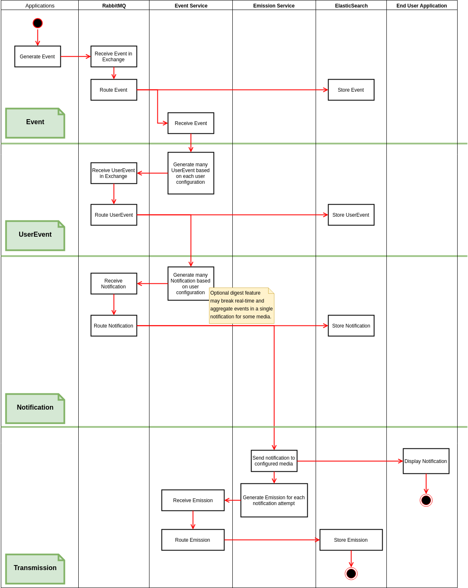

Docs
====

Docs images are built with [draw.io](https://www.draw.io/), and sources are available as xml files in `docs` directory.

Roadmap
-------

[Roadmap is available here](https://github.com/GIP-RECIA/Notification-POC/blob/master/docs/ROADMAP.md)

Architecture
------------

Software components
-------------------

* **RabbitMQ**

**Role**: Handle reception and dispatching of events produced by applications.

* **Apache**

**Role**: WebSocket Reverse Proxy in front of RabbitMQ WebStomp plugin WebSocket service, to allow web applications 
to be notified through the same URL.

* **ElasticSearch**

**Role**: Consume all events handled by RabbitMQ to ensure storage, search, tracking and statistics. Store events and 
generated notifications.

* **CLI Application**

**Tech**: Java/Vanilla  
**RabbitMQ Protocol**: AMQP  
**Type**: Command Line Interface application  
**Role**: Generate/consume random events (Step 1) and real world events (Step 3).

- **Web Application**

**Tech**: HTML5/VueJS  
**RabbitMQ Protocol**: STOMP over WebSocket  
**Type**: Web application  
**Role**: Display generated random events (Step 1) and real world events (Step 3). Emit real world events (Step 3).

- **Notification Service**

**Tech**: Java/Spring Boot  
**RabbitMQ Protocol**: AMQP + STOMP over WebSocket  
**Type**: Service  
**Role**: Register users to various events type and media, and dispatch incoming events to notifications based
on registrations.
